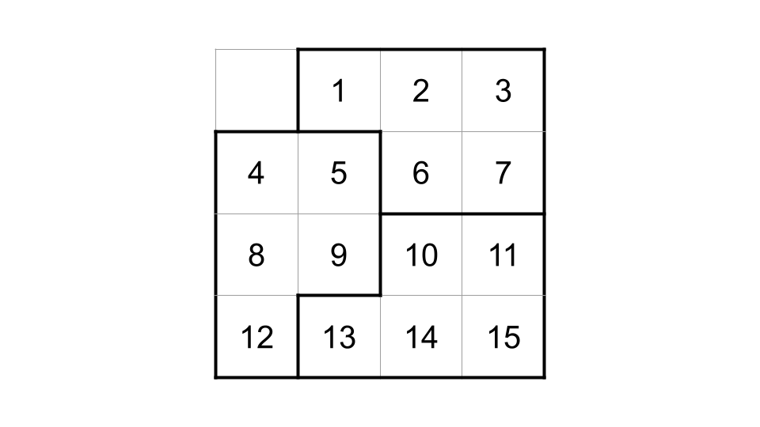
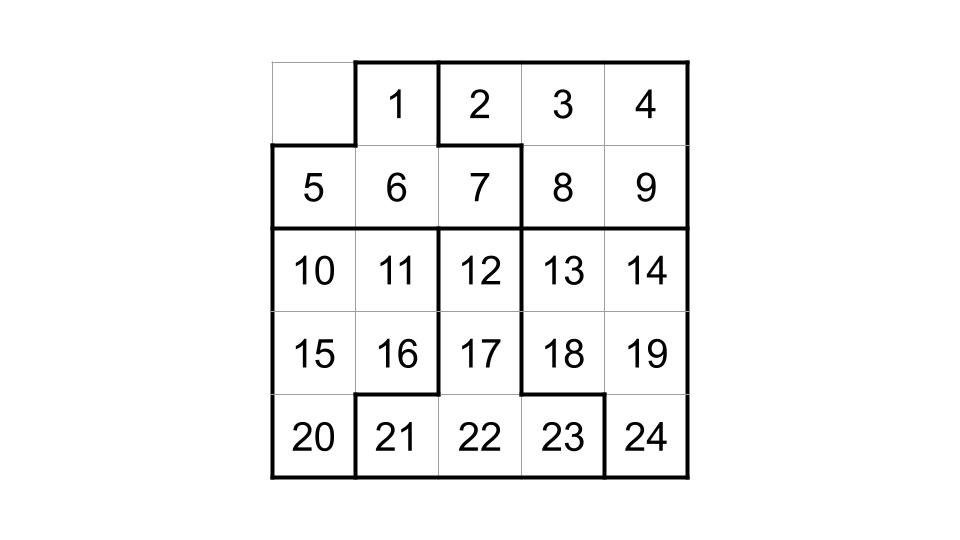
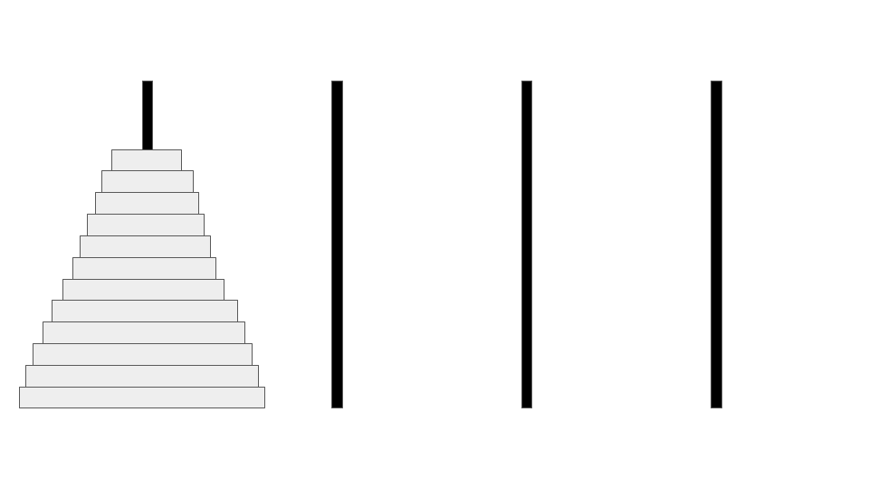
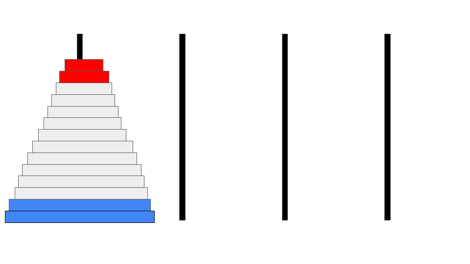
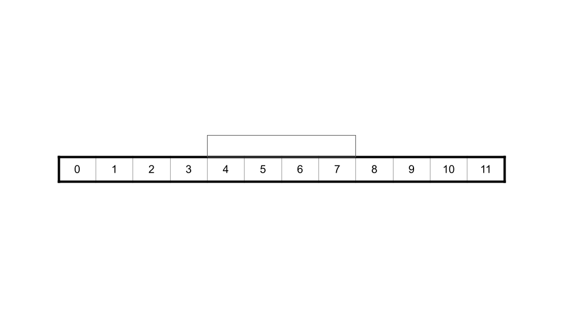
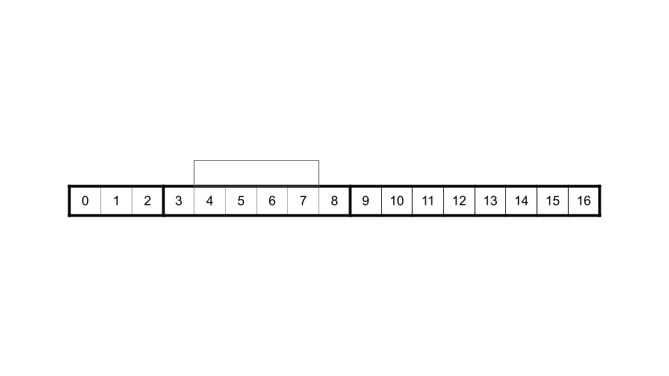
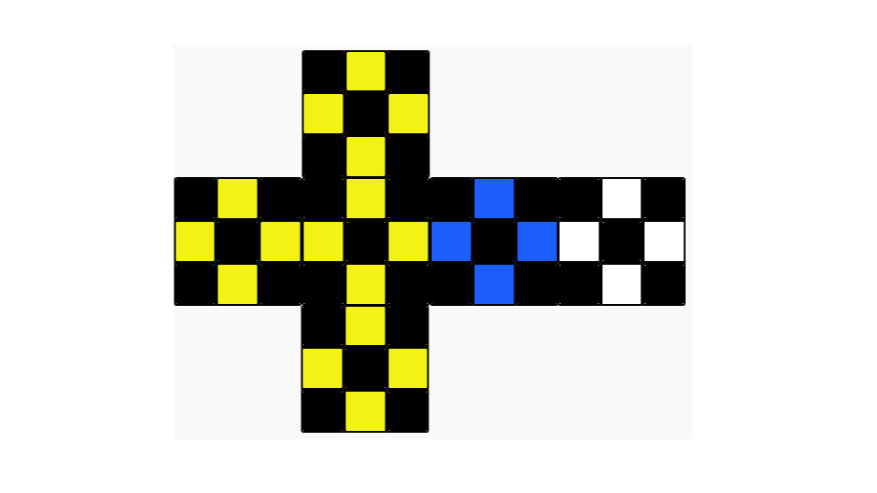
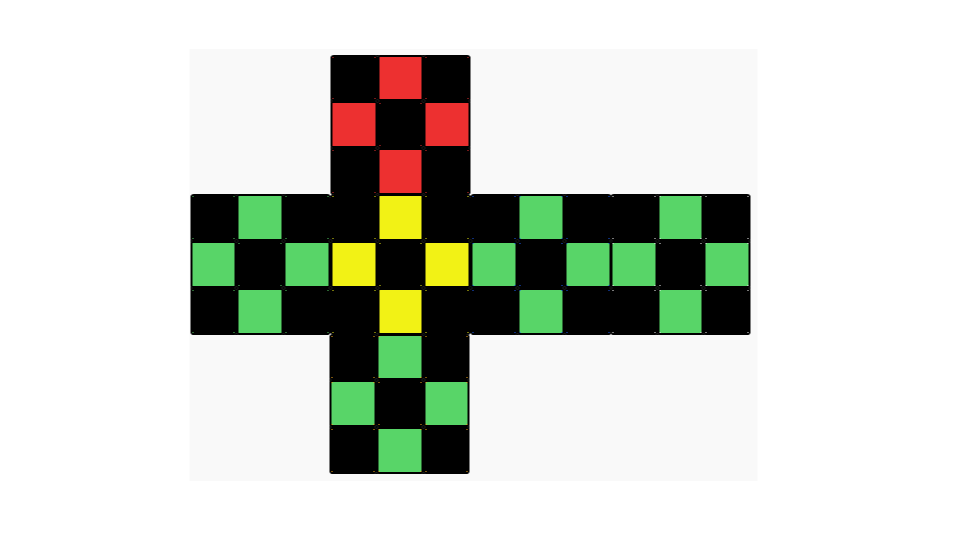
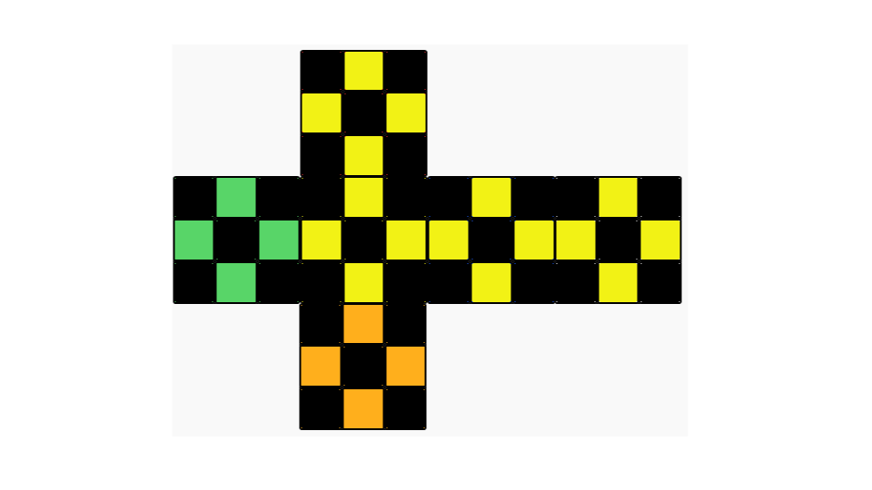

# Objetivo

El objetivo del proyecto es aprender sobre el modelo de espacio de estados y sobre
los diferentes algoritmos de b&uacute;squeda heur&iacute;stica. No s&oacute;lo se
evaluar&aacute; la correctitud de la implementaci&oacute;n; es importante que los
algoritmos sean eficientes y puedan resolver los problemas propuestos en los
tiempos estipulados.

# Problemas

Consideramos los siguientes problemas:
* N-puzzles: 15-puzzle y 24-puzzle
* Top spin: 12-4, 14-4, y 17-4
* Torre de Hanoi con 4 astas: 12, 14, y 18 discos
* Cubo de Rubik: 3x3x3

# Como correr el programa

```
cd psvn-for-ci5437/<nombre_problema>
make <nombre_problema>.aStar
make <nombre_problema>.idaStar
make <nombre_problema>/abs{i}.pdb #para cada abs{i}.txt en el directorio
./<nombre_problema>.aStar
./<nombre_problema>.idaStar
```

# &Aacute;rboles de b&uacute;squeda

## 15Puzzle
### Con Prunning
- Tiempo de Ejecucion: 100 segundos antes de almorzarse la RAM
- Numero de estados generados: 110558079
- Factor de ramificación: 1.841

### Sin Prunning
- Tiempo de Ejecucion: 38 segundos antes de almorzarse la RAM
- Numero de estados generados: 249119085
- Factor de ramificación: 3.236

| Profundidad | Nodos Generados (Prunning) | Nodos Generados (Sin prunning) |
| :-----------: | :-----------: | :-----------: |
| 0 | 1 | 1 |
| 1 | 2 | 2 |
| 2 | 4 | 6 |
| 3 | 10 | 18 |
| 4 | 24 | 58 |
| 5 | 54 | 186 |
| 6 | 107 | 602 |
| 7 | 212 | 1946 |
| 8 | 446 | 6298 |
| 9 | 946 | 20378 |
| 10 | 1948 | 65946 |
| 11 | 3938 | 213402 |
| 12 | 7808 | 690586 |
| 13 | 15544 | 2234778 |
| 14 | 30821 | 7231898 |
| 15 | 60842 | 23402906 |
| 16 | 119000 | 75733402 |
| 17 | 231844 |
| 18 | 447342 |
| 19 | 859744 |
| 20 | 1637383 |
| 21 | 3098270 |
| 22 | 5802411 |
| 23 | 10783780 |
| 24 | 19826318 |
| 25 | 36142146 |


## 24Puzzle 
### Con Prunning

- Tiempo de Ejecucion: 50 segundos antes de almorzarse la RAM
- Numero de estados generados: 45825409
- Factor de ramificación: 2.221

### Sin Prunning

- Tiempo de Ejecucion: 30 segundos antes de almorzarse la RAM
- Numero de estados generados: 132070358
- Factor de ramificación: 3.444

| Profundidad | Nodos Generados (Prunning) | Nodos Generados (Sin prunning) |
| :-----------: | :-----------: | :-----------: |
| 0 | 1 | 1 |
| 1 | 2 | 2 |
| 2 | 4 | 6 |
| 3 | 10 | 18 |
| 4 | 26 | 60 |
| 5 | 64 | 198 |
| 6 | 159 | 684 |
| 7 | 366 | 2322 |
| 8 | 862 | 8100 |
| 9 | 1904 | 27702 |
| 10 | 4538 | 96876 |
| 11 | 10238 | 331938 |
| 12 | 24098 | 1161540 |
| 13 | 53186 | 3981798 |
| 14 | 123435 | 13935564 |
| 15 | 268416 | 47777202 |
| 16 | 616374 |
| 17 | 1326882 |
| 18 | 3021126 |
| 19 | 6438828 |
| 20 | 14524718 |

## TopSpin12-4 
### Con Prunning

- Tiempo de Ejecucion: 76.71 segundos 
- Numero de estados generados: 39916800
- Factor de ramificación: 1.000

### Sin Prunning

- Tiempo de Ejecucion: 77 segundos 
- Numero de estados generados: 83828488
- Factor de ramificación: 12.000

| Profundidad | Nodos Generados (Prunning) | Nodos Generados (Sin prunning) |
| :-----------: | :-----------: | :-----------: |
| 0 | 1 | 1 |
| 1 | 12 | 12 |
| 2 | 102 | 144 |
| 3 | 784 | 1728 |
| 4 | 5725 | 20736 |
| 5 | 39990 | 248832 |
| 6 | 258893 | 2985984 |
| 7 | 1487496 | 35831808 |
| 8 | 6573865 |
| 9 | 16440505 |
| 10 | 13612079 |
| 11 | 1463903 |
| 12 | 33445 |

## TopSpin14-4 
### Con Prunning

- Tiempo de Ejecucion: 100 segundos antes de almorzarse la RAM
- Numero de estados generados: 31964930
- Factor de ramificación: 6.631

### Sin Prunning

- Tiempo de Ejecucion: 60 segundos antes de almorzarse la RAM
- Numero de estados generados: 46456654
- Factor de ramificación: 14.000

| Profundidad | Nodos Generados (Prunning) | Nodos Generados (Sin prunning) |
| :-----------: | :-----------: | :-----------: |
| 0 | 1 | 1 |
| 1 | 14 | 14 |
| 2 | 133 | 196 |
| 3 | 1106 | 2744 |
| 4 | 8631 | 38416 |
| 5 | 64722 | 537824 |
| 6 | 467257 | 7529536 |
| 7 | 3239166 |
| 8 | 21292544 |

## TopSpin17-4 
### Con Prunning

- Tiempo de Ejecucion: 101 segundos antes de almorzarse la RAM
- Numero de estados generados: 25846972
- Factor de ramificación: 7.689

### Sin Prunning

- Tiempo de Ejecucion: 65 segundos antes de almorzarse la RAM
- Numero de estados generados: 40883217
- Factor de ramificación: 17.000

| Profundidad | Nodos Generados (Prunning) | Nodos Generados (Sin prunning) |
| :-----------: | :-----------: | :-----------: |
| 0 | 1 | 1 |
| 1 | 17 | 17 |
| 2 | 187 | 289 |
| 3 | 1734 | 4913 |
| 4 | 14841 | 83521 |
| 5 | 121261 | 1419857 |
| 6 | 956828 | 24137569 |
| 7 | 7323702 |

## Hanoi4-12 
### Con Prunning

- Tiempo de Ejecucion: 19.07 segundos
- Numero de estados generados: 16777216
- Factor de ramificación: 1.000

### Sin Prunning

- Tiempo de Ejecucion: 15 segundos
- Numero de estados generados: 37158952
- Factor de ramificación: 5.633

| Profundidad | Nodos Generados (Prunning) | Nodos Generados (Sin prunning) |
| :-----------: | :-----------: | :-----------: |
| 0 | 1 | 1 |
| 1 | 3 | 3 |
| 2 | 6 | 15 |
| 3 | 12 | 75 |
| 4 | 30 | 393 |
| 5 | 30 | 2109 |
| 6 | 66 | 11487 |
| 7 | 96 | 63375 |
| 8 | 126 | 352755 |
| 9 | 210 | 1978341 |
| 10 | 330 | 11161197 |
| 11 | 318 |
| 12 | 462 |
| 13 | 816 |
| 14 | 1032 |
| 15 | 936 |
| 16 | 1044 |
| 17 | 1752 |
| 18 | 2610 |
| 19 | 3036 |
| 20 | 3528 |
| 21 | 3306 |
| 22 | 4578 |
| 23 | 6318 |
| 24 | 9108 |
| 25 | 10674 |
| 26 | 11580 |
| 27 | 11844 |
| 28 | 13374 |
| 29 | 17124 |
| 30 | 23664 |
| 31 | 32184 |
| 32 | 36984 |
| 33 | 39822 |
| 34 | 38544 |
| 35 | 39936 |
| 36 | 45936 |
| 37 | 57990 |
| 38 | 77262 |
| 39 | 96366 |
| 40 | 116052 |
| 41 | 127092 |
| 42 | 122142 |
| 43 | 112086 |
| 44 | 116814 |
| 45 | 135078 |
| 46 | 157326 |
| 47 | 192498 |
| 48 | 246468 |
| 49 | 304638 |
| 50 | 353958 |
| 51 | 387960 |
| 52 | 414768 |
| 53 | 426558 |
| 54 | 409446 |
| 55 | 397866 |
| 56 | 442128 |
| 57 | 505836 |
| 58 | 574950 |
| 59 | 672774 |
| 60 | 819612 |
| 61 | 969552 |
| 62 | 1084908 |
| 63 | 1145952 |
| 64 | 1174230 |
| 65 | 1134474 |
| 66 | 1018938 |
| 67 | 832344 |
| 68 | 647394 |
| 69 | 458982 |
| 70 | 319698 |
| 71 | 195384 |
| 72 | 102024 |
| 73 | 44154 |
| 74 | 14664 |
| 75 | 3618 |
| 76 | 1266 |
| 77 | 294 |
| 78 | 156 |
| 79 | 72 |
| 80 | 18 |
| 81 | 6 |

## Hanoi4-14 
### Con Prunning

- Tiempo de Ejecucion: 133 segundos antes de almorzarse la RAM
- Numero de estados generados: 93295476
- Factor de ramificación: 1.075

### Sin Prunning

- Tiempo de Ejecucion: 15 segundos antes de almorzarse la RAM
- Numero de estados generados: 34184963
- Factor de ramificación: 5.633

| Profundidad | Nodos Generados (Prunning) | Nodos Generados (Sin prunning) |
| :-----------: | :-----------: | :-----------: |
| 0 | 1 | 1 |
| 1 | 3 | 3 |
| 2 | 6 | 15 |
| 3 | 12 | 75 |
| 4 | 30 | 393 |
| 5 | 30 | 2109 |
| 6 | 66 | 11487 |
| 7 | 96 | 63375 |
| 8 | 126 | 352755 |
| 9 | 210 | 1978341 |
| 10 | 330 | 11161197 |
| 11 | 318 |
| 12 | 462 |
| 13 | 816 |
| 14 | 1032 |
| 15 | 936 |
| 16 | 1044 |
| 17 | 1752 |
| 18 | 2610 |
| 19 | 3036 |
| 20 | 3528 |
| 21 | 3306 |
| 22 | 4578 |
| 23 | 6318 |
| 24 | 9108 |
| 25 | 10674 |
| 26 | 11580 |
| 27 | 11844 |
| 28 | 13374 |
| 29 | 17124 |
| 30 | 23664 |
| 31 | 32184 |
| 32 | 36984 |
| 33 | 39822 |
| 34 | 38544 |
| 35 | 39936 |
| 36 | 45936 |
| 37 | 57990 |
| 38 | 77262 |
| 39 | 96366 |
| 40 | 116052 |
| 41 | 127092 |
| 42 | 122142 |
| 43 | 112086 |
| 44 | 116814 |
| 45 | 135078 |
| 46 | 157326 |
| 47 | 192498 |
| 48 | 246468 |
| 49 | 304650 |
| 50 | 354018 |
| 51 | 388128 |
| 52 | 415206 |
| 53 | 427710 |
| 54 | 411804 |
| 55 | 402504 |
| 56 | 451236 |
| 57 | 521094 |
| 58 | 600684 |
| 59 | 714750 |
| 60 | 883602 |
| 61 | 1064970 |
| 62 | 1228656 |
| 63 | 1349322 |
| 64 | 1464336 |
| 65 | 1539420 |
| 66 | 1565604 |
| 67 | 1554324 |
| 68 | 1610436 |
| 69 | 1702956 |
| 70 | 1889394 |
| 71 | 2143170 |
| 72 | 2530788 |
| 73 | 2984394 |
| 74 | 3498924 |
| 75 | 4006014 |
| 76 | 4533006 |
| 77 | 4972920 |
| 78 | 5337480 |
| 79 | 5564034 |
| 80 | 5692800 |
| 81 | 5676552 |
| 82 | 5692404 |
| 83 | 5788620 |
| 84 | 6133170 |

## Hanoi4-18
### Con Prunning

- Tiempo de Ejecucion: 80 segundos antes de almorzarse la RAM
- Numero de estados generados: 45030276
- Factor de ramificación: 1.119

### Sin Prunning

- Tiempo de Ejecucion: 15 segundos antes de almorzarse la RAM
- Numero de estados generados: 25381162
- Factor de ramificación: 5.633

| Profundidad | Nodos Generados (Prunning) | Nodos Generados (Sin prunning) |
| :-----------: | :-----------: | :-----------: |
| 0 | 1 | 1 |
| 1 | 3 | 3 |
| 2 | 6 | 15 |
| 3 | 12 | 75 |
| 4 | 30 | 393 |
| 5 | 30 | 2109 |
| 6 | 66 | 11487 |
| 7 | 96 | 63375 |
| 8 | 126 | 352755 |
| 9 | 210 | 1978341 |
| 10 | 330 | 11161197 |
| 11 | 318 |
| 12 | 462 |
| 13 | 816 |
| 14 | 1032 |
| 15 | 936 |
| 16 | 1044 |
| 17 | 1752 |
| 18 | 2610 |
| 19 | 3036 |
| 20 | 3528 |
| 21 | 3306 |
| 22 | 4578 |
| 23 | 6318 |
| 24 | 9108 |
| 25 | 10674 |
| 26 | 11580 |
| 27 | 11844 |
| 28 | 13374 |
| 29 | 17124 |
| 30 | 23664 |
| 31 | 32184 |
| 32 | 36984 |
| 33 | 39822 |
| 34 | 38544 |
| 35 | 39936 |
| 36 | 45936 |
| 37 | 57990 |
| 38 | 77262 |
| 39 | 96366 |
| 40 | 116052 |
| 41 | 127092 |
| 42 | 122142 |
| 43 | 112086 |
| 44 | 116814 |
| 45 | 135078 |
| 46 | 157326 |
| 47 | 192498 |
| 48 | 246468 |
| 49 | 304650 |
| 50 | 354018 |
| 51 | 388128 |
| 52 | 415206 |
| 53 | 427710 |
| 54 | 411804 |
| 55 | 402504 |
| 56 | 451236 |
| 57 | 521094 |
| 58 | 600684 |
| 59 | 714750 |
| 60 | 883602 |
| 61 | 1064970 |
| 62 | 1228656 |
| 63 | 1349322 |
| 64 | 1464336 |
| 65 | 1539426 |
| 66 | 1565634 |
| 67 | 1554408 |
| 68 | 1610640 |
| 69 | 1703436 |
| 70 | 1890282 |
| 71 | 2144742 |
| 72 | 2533656 |
| 73 | 2988834 |
| 74 | 3506376 |
| 75 | 4017900 |
| 76 | 4551204 |

## Rubik3x3x3
### Con Prunning
- Tiempo de Ejecucion: 40 segundos antes de almorzarse la RAM
- Numero de estados generados: 6312369
- Factor de ramificación: 13.299

### Sin Prunning
- Tiempo de Ejecucion: 32 segundos antes de almorzarse la RAM
- Numero de estados generados: 8711545
- Factor de ramificación: 18.000

| Profundidad | Nodos Generados (Prunning) | Nodos Generados (Sin prunning) |
| :-----------: | :-----------: | :-----------: |
| 0 | 1 | 1 |
| 1 | 18 | 18 |
| 2 | 243 | 324 |
| 3 | 3240 | 5832 |
| 4 | 43239 | 104976 |
| 5 | 574908 | 1889568 |

# Abstracciones

## 15Puzzle

Se mapearon todos los estados a blank a excepción de la particion correspondiente a la abstracción.

## 24Puzzle

Se mapearon todos los estados a blank a excepción de la particion correspondiente a la abstracción.

## Hanoi12-4

Se pudo generar un pdb sin una abstracción del problema.

## Hanoi14-4

La primera abstracción proyecta los 2 discos mas pequeños.  
La segunda abstracción proyecta los 2 discos mas grandes. 

## Hanoi18-4

La primera abstracción proyecta los 6 discos mas pequeños.  
La segunda abstracción proyecta los siguientes 6 discos mas pequeños. 

## TopSpin4-12

Se pudo generar un pdb sin una abstracción del problema.

## TopSpin4-14

Se mapearon todos los estados a 14 (numero no perteneciente al dominio) a excepción de la particion correspondiente a la abstracción.

## TopSpin4-17

Se mapearon todos los estados a 17 (numero no perteneciente al dominio) a excepción de la particion correspondiente a la abstracción.

## Rubik
### Rubik Corner

Se proyectaron todos los stickers pertenecientes a los lados, dejando solo las esquinas.

### Rubik Edge1

Se proyectaron todos los stickers pertenecientes a las esquinas y se mapearon los colores rojo verde y naranja a amarillo.

### Rubik Edge2

Se proyectaron todos los stickers pertenecientes a las esquinas y se mapearon los colores blanco azul y naranja a verde.

### Rubik Edge3

Se proyectaron todos los stickers pertenecientes a las esquinas y se mapearon los colores blanco  azul y rojo a amarillo.

# Algoritmos informados

Estudiar la b&uacute;squeda de *soluciones &oacute;ptimas* con algoritmos informados.
Buscar soluciones para las instancias dadas en cada problema utilizando los algoritmos:
A* con eliminaci&oacute;n retardada de duplicados (DDD) e IDA* con eliminaci&oacute;n
parcial de duplicados. Para las heur&iacute;sticas en cada problema:
* N-puzzles: distancia Manhattan (15-puzzle) y diferentes additive PDBs (15- y 24-puzzle)
* Cubo de Rubik: max de corner PDB y 2 edge PDBs (si son demasiado grandes, dividirlas en varias PDBs peque&ntilde;as)
* Top Spin: max de diferents PDBs
* Torre de Hanoi con 4 astas: max de diferentes PDBs

# Casos de prueba

## NPuzzle
La heuristica Manhattan genera una cantidad de estados mucho mayor a la de los PDB generados con las abstraciones. Por otro lado IDA* tiene un mejor rendimiento que A*, debido a su velocidad de generacion de estados.  
Dado que el tamaño del problema es grande, para soluciones muy largas A* debe generar muchos estados, por lo que terminara consumiendo la memoria antes de encontrar la solución. 

### 15Puzzle
| Caso | Algoritmo | Heuristica | Dificultad | Movimientos | Estados Totales | Tiempo(seg) | Estados / seg | RAM (Gb) |
| :---: | :---: | :---: | :---: | :---: | :---: | :---: | :---: | :---: |
| 1 | IDA* | PDB | Facil | 41 | 103896 | 0.02586 | 4.0170e+06 | 0.0657 |
| 1 | A* | PDB | Facil | 41 | 36562 | 0.0687 | 531633 | 0.0724 |
| 1 | IDA* | Manhattan | Facil | 41 | 755897 | 3.3737 | 224052 | 0.0310 |
| 1 | A* | Manhattan | Facil | 41 | 199300 | 2.9824 | 40650.4 | 0.0472 |
| 2 | IDA* | PDB | Facil | 49 | 4993802 | 1.1887 | 4.2010e+06 | 0.1211 |
| 2 | A* | PDB | Facil | 49 | 1952281 | 6.7525 | 289117 | 0.5431 |
| 2 | IDA*| Manhattan | Facil | 49 | 14084532 | 62.3114 | 226035 | 0.00 |
| 2 | A* | Manhattan | Facil | 49 | 5323478 | 87.1404 | 61090.8 | 1.2906 |
| 3 | IDA* | PDB | Facil | 50 | 27211387 | 6.2004 | 4.3886e+06 | 0.1156 |
| 3 | A* | PDB | Facil | 50 | 5809142 | 23.7837 | 244249 | 1.4762 |
| 3 | IDA* | Manhattan | Facil | 50 | 248393754 | 1059.36 | 234474 | 0.2256 |
| 3 | A* | Manhattan | Facil | 50 | 26161682 | 434.13 | 60262.3 | 6.276 |
| 4 | IDA* | PDB | Facil | 55 | 156911686 | 36.5663 | 4.2911e+06 | 0.0732 |
| 4 | A* | PDB | Facil | 55 | 26142982 | 136.171 | 191986 | 4.5849 |
| 4 | IDA* | Manhattan | Facil | OT | 425522337 | 1832.41 | 232221 | 0.00 |
| 4 | A* | Manhattan | Facil | OM | 46600000 | 776.29 | 60029.1 | 11.9626 |
| 5 | IDA* | PDB | Dificil | 65 | 1629636925 | 386.586 | 4.2154e+06 | 1.0750 |
| 5 | A* | PDB | Dificil | OM | 47200000 | 268.459 | 175818 | 12.4602 |
| 5 | IDA* | Manhattan | Dificil | OT | 478538337 | 1791.21 | 267160 | 0.0547 |
| 5 | A* | Manhattan | Dificil | OM | 48000000 | 832.368 | 57666.8 | 12.4159 |

### 24Puzzle
| Caso | Algoritmo  | Dificultad | Movimientos | Estados Totales | Tiempo(seg) | Estados / seg | RAM (Gb) |
| :---: | :---: | :---: | :---: | :---: | :---: | :---: | :---: |
| 1 | IDA* | Facil | 51 | 4652838 | 1.9787 | 2.3513e+06 | 2.0183 |
| 1 | A* | Facil | 51 | 1495584 | 6.37049 | 234768 | 4.49022 |
| 2 | IDA* | Facil | 54 | 19082541 | 7.9944 | 2.3869e+06 | 2.0238 |
| 2 | A* | Facil | 54 | 3923671 | 19.3092 | 203202 | 3.2083 |
| 3 | IDA* | Facil | 62 | 621092097 | 255.712 | 2.4288e+06 | 2.0216 |
| 3 | A* | Facil | 62 | 36723224 | 198.842  | 184686 | 10.9324 |
| 4 | IDA | Facil | 58 | 81641185 | 33.7818 | 2.4167e+06 | 1.9821 |
| 4 | A* | Facil | 58 | 16908537 | 94.9307 | 178114 | 7.0939 |
| 5 | IDA* | Dificil | 74 | 1532880375 | 635.411 | 2.4124e+06 | 4.3527 |
| 5 | A* | Dificil | OM | 26200000 | 145.917 | 179554 | 12.1384 |

## TopSpin
TopSpin es un problema un numero maximo de movimientos por solución corto. IDA* aunque tiene que generar mas estados, la velocidad de generacion compensa esta desventaja, permitiendo que encuentre la solución antes de A*.

### TopSpin12-4
| Caso | Algoritmo | Dificultad | Movimientos | Estados Totales | Tiempo(seg) | Estados / seg | RAM (Gb) |
| :---: | :---: | :---: | :---: | :---: | :---: | :---: | :---: |
| 1 | IDA* | Facil | 5 | 23 | 3.2e-05 | 718750 | 0.9963 |
| 1 | A* | Facil | 5 | 6 | 4.7e-05 | 127660 | 1.009 |
| 2 | IDA* | Facil | 5 | 26 | 3.2e-05 | 812500 | 1.0006 |
| 2 | A* | Facil | 5 | 6 | 3.57e-04 | 120000 | 1.0001 |
| 3 | IDA* | Facil | 8 | 31 | 3.5e-05 | 885714 | 1.0004 |
| 3 | A* | Facil | 8 | 14 | 8.1e-05 | 172840 | 1.0033 |
| 4 | IDA* | Facil | 9 | 40 | 3.6e-05 | 1.1111e+06 | 1.0005 |
| 4 | A* | Facil | 9 | 20 | 0.0001 | 175439 | 1.0023 |
| 5 | IDA* | Dificil | 11 | 40 | 3.7e-05 | 1.0810e+06 | 1.0104 |
| 5 | A* | Dificil | 11 | 207 | 0.0008 | 255240 | 1.0021 |

### TopSpin14-4
| Caso | Algoritmo | Dificultad | Movimientos | Estados Totales | Tiempo(seg) | Estados / seg | RAM (Gb) |
| :---: | :---: | :---: | :---: | :---: | :---: | :---: | :---: |
| 1 | IDA* | Facil | 5 | 62 | 5.4e-05 | 1.14815e+06 | 0.3490 |
| 1 | A* | Facil | 5 | 12 | 0.0001 | 112150 | 0.3513 |
| 2 | IDA* | Facil | 5 | 35 | 4.9e-05 | 714286 | 0.3541 |
| 2 | A* | Facil | 5 | 8 | 6.9e-05 | 115942 | 0.3518 |
| 3 | IDA* | Facil | 8 | 48 | 4.5e-05 | 1.0666e+06 | 0.3517 |
| 3 | A* | Facil | 8 | 47 | 0.0003 | 145062 | 0.3516 |
| 4 | IDA* | Facil | 9 | 483 | 0.0002 | 2.3221e+06 | 0.3519 |
| 4 | A* | Facil | 9 | 62 | 0.0003 | 155388 | 0.3513 |
| 5 | IDA* | Dificil | 12 | 37312 | 0.0135 | 2.7567e+06 | 0.3499 |
| 5 | A* | Dificil | 12 | 9723 | 0.0631 | 153877 | 0.3614 |

### TopSpin17-4
| Caso | Algoritmo | Dificultad | Movimientos | Estados Totales | Tiempo(seg) | Estados / seg | RAM (Gb) |
| :---: | :---: | :---: | :---: | :---: | :---: | :---: | :---: |
| 1 | IDA* | Facil | 5 | 31 | 4.1e-05 | 756098 | 3.1898 |
| 1 | A* | Facil | 5 | 11 | 0.0001 | 84615.4 | 3.1904 |
| 2 | IDA* | Facil | 10 | 537 | 0.0002 | 2.1394e+06 | 3.1916 |
| 2 | A* | Facil | 10 | 138 | 0.0011 | 115481 | 3.1934 |
| 3 | IDA* | Facil | 13 | 2506285 | 0.9032 | 2.7747e+06 | 3.1862 |
| 3 | A* | Facil | 13 | 203911 | 2.1477 | 94941 | 3.4108 |
| 4 | IDA* | Facil | 14 | 1447096 | 0.5026 | 2.8790e+06 | 3.193 |
| 4 | A* | Facil | 14 | 561444 | 6.0778 | 92375.3 | 3.7979 |
| 5 | IDA* | Dificil | 15 | 13708490 | 5.1083 | 2.6835e+06 | 3.1871 |
| 5 | A* | Dificil | 15 | 1004104 | 11.7515 | 85444.4 | 4.2599 |

## Hanoi4
Las torres de hanoi es un problema con un factor de ramificacion bajo, y las soluciones generalmente requieren de muchos pasos. Estas caracteristicas son inconvenientes para IDA* porque este genera nodos por cada cota alcanzada y al ser necesarios muchos pasos, la generacion de estados se hace demasiado costosa en tiempo. A* aprovecha el pequeño factor de ramificacion para encontrar la solución en un tiempo razonable, aunque la cantidad de movimientos.

### Hanoi4-12
| Caso | Algoritmo | Dificultad | Movimientos | Estados Totales | Tiempo(seg) | Estados / seg | RAM (Gb) |
| :---: | :---: | :---: | :---: | :---: | :---: | :---: | :---: |
| 1 | IDA* | Facil | 4 | 12 | 3.6e-05 | 333333 | 1.623 |
| 1 | A* | Facil | 4 | 7 | 4.6e-05 | 152174 | 1.6278 |
| 2 | IDA* | Facil | 19 | 73 | 7.6e-05 | 960526 | 1.6211 |
| 2 | A* | Facil | 19 | 57 | 1.78e-04 | 320225 | 1.6272 |
| 3 | IDA* | Facil | 22 | 87 | 7.8e-05 | 1.11538e+06 | 1.6216 |
| 3 | A* | Facil | 22 | 58 | 2.06e-04 | 281553 | 1.6279 |
| 4 | IDA* | Facil | 26 | 103 | 8.8e-05 | 1.17045e+06 | 1.6225 |
| 4 | A* | Facil | 26 | 39 | 1.43e-04 | 272727 | 1.6257 |
| 5 | IDA* | Dificil | 65 | 255 | 1.62e-04 | 1.57407e+06 | 1.6194 |
| 5 | A* | Dificil | 65 | 649 | 0.0017 | 366253 | 1.6282 |

### Hanoi4-14
| Caso | Algoritmo | Dificultad | Movimientos | Estados Totales | Tiempo(seg) | Estados / seg | RAM (Gb) |
| :---: | :---: | :---: | :---: | :---: | :---: | :---: | :---: |
| 1 | IDA* | Facil | 7 | 24 | 9.1e-05 | 263736 | 5.6399 |
| 1 | A* | Facil | 7 | 8 | 8.1e-05 | 98765.4 | 5.6678 |
| 2 | IDA* | Facil | 17 | 65 | 1.56e-04 | 416667 | 5.6425 |
| 2 | A* | Facil | 17 | 34 | 1.77e-04 | 192090 | 11.3153 |
| 3 | IDA* | Facil | 21 | 82 | 1.58e-04 | 518987 | 5.6326 |
| 3 | A* | Facil | 21 | 42 | 2.01e-04 | 208955 | 11.2688 |
| 4 | IDA* | Facil | 35 | 139 | 2.15e-04 | 646512 | 5.6327 |
| 4 | A* | Facil | 35 | 47 | 2.24e-04 | 209821 | 11.2651 |
| 5 | IDA* | Dificil | OT | 629742785 | 1752.41 | 359358 | 3.8348 |
| 5 | A* | Dificil | 87 | 608303 |  5.556 | 109485 | 11.6389 |

### Hanoi4-18
| Caso | Algoritmo | Dificultad | Movimientos | Estados Totales | Tiempo(seg) | Estados / seg | RAM (Gb) |
| :---: | :---: | :---: | :---: | :---: | :---: | :---: | :---: |
| 1 | IDA* | Facil | 10 | 40 | 7.7e-05 | 519481 | 4.7538 |
| 1 | A* | Facil | 10 | 16 | 1.19e-04 | 134454 | 4.7579 |
| 2 | IDA* | Facil | 17 | 5777 | 0.003 | 1.87018e+06 | 4.761 |
| 2 | A* | Facil | 17 | 293 | 0.0015 | 195073 | 4.7546 |
| 3 | IDA* | Facil | 21 | 23767047 | 11.4223 | 2.08075e+06 | 4.7558 |
| 3 | A* | Facil | 21 | 2908 | 0.0163 | 178394 | 4.74997 |
| 4 | IDA* | Facil | OT | 3995016587 | 1803.19 | 2.21552e+06 | 5.2462 |
| 4 | A* | Facil | 34 | 182324 | 1.6217 | 112423 | 9.6439 |
| 5 | IDA* | Dificil | OT | 4020521391 | 1813.11 | 2.21747e+06 | 5.9038 |
| 5 | A* | Dificil | 50 | 4150971 | 52.9804 | 78349.3 | 7.6076 |

## Rubik3x3x3
| Caso | Algoritmo | Dificultad | Movimientos | Estados Totales | Tiempo(seg) | Estados / seg | RAM (Gb) |
| :---: | :---: | :---: | :---: | :---: | :---: | :---: | :---: |
| 1 | IDA* | Facil | 4 | 36 | 8.3e-05 | 433735 | 11.3683 |
| 1 | A* | Facil | 4 | 5 | 1.23e-04 | 40650.4 | 11.3071 |
| 2 | IDA* | Facil | 8 | 66 | 1.2e-04 | 550000 | 11.52 |
| 2 | A* | Facil | 8 | 16 | 3.57e-04 | 44817.9 | 11.3685 |
| 3 | IDA* | Facil | 13 | 1422681 | 1.7895 | 795012 | 11.5613 |
| 3 | A* | Facil | OM | 100000 | 2.3806 | 42005.3 | 13.2543 |
| 4 | IDA* | Facil | 14 | 11600916 | 13.8875 | 835347 | 11.5212 |
| 4 | A* | Facil | OM | 100000 | 2.32163 | 43073.1 | 13.2626 |
| 5 | IDA* | Dificil | 15 | 806745502 | 980.18 | 823058 | 11.28 |
| 5 | A* | Dificil | OM | 100000 | 2.3892 | 41853.4 | 13.2459 |

El cubo de rubik es un problema donde las soluciones no pasan de 20 pasos, esto es conveniente para IDA* ya que a mayor cantidad de pasos la cantidad de nodos generados por profundidad aumenta significativamente.  
Por otro lado el factor de ramificacion del cubo de rubik es bastante alto, por lo que se generan muchos estados por cada nodo visitado, causando que la memoria se agote rapidamente. Esto perjudica gravemente el desempeño de A*.

## Instancias usadas
```
15puzzle
Caso 1: 13 8 14 3 9 1 b 7 15 5 4 10 12 2 6 11
Caso 2: 10 9 3 11 b 13 2 14 5 6 4 7 8 15 1 12
Caso 3: 7 1 2 4 8 3 6 11 10 15 b 5 14 12 13 9
Caso 4: 3 15 2 5 11 6 4 7 12 9 1 b 13 14 10 8
Caso 5: 15 2 12 11 14 13 9 5 1 3 8 7 b 10 6 4

24puzzle
Caso 1: 5 2 3 13 4 10 6 7 11 14 20 1 17 9 8 16 22 B 12 15 21 23 24 18 19
Caso 2: 12 10 5 7 8 11 6 2 3 4 20 1 13 9 23 15 B 17 14 19 16 21 22 18 24
Caso 3: 5 1 9 8 4 10 2 16 12 14 18 6 B 22 3 15 11 24 13 23 20 17 7 19 21
Caso 4: 5 1 3 13 4 20 10 6 B 14 17 2 11 7 9 16 22 24 12 8 21 23 18 19 15
Caso 5: 5 12 6 9 1 15 10 4 2 3 B 14 24 8 17 13 7 20 11 23 18 16 22 21 19

TopSpin12-4
Caso 1: 8 7 1 0 4 5 6 9 2 3 10 11
Caso 2: 8 4 5 10 9 7 0 1 2 3 6 11
Caso 3: 0 10 9 8 7 5 2 1 4 3 6 11
Caso 4: 10 1 5 4 3 0 8 9 7 6 2 11
Caso 5: 8 10 6 3 1 2 4 7 0 5 9 11 

TopSpin14-4
Caso 1: 6 11 0 1 2 3 4 7 8 12 5 10 9 13
Caso 2: 6 7 3 8 4 5 0 10 9 12 11 1 2 13
Caso 3: 9 12 11 0 7 1 2 3 8 6 5 4 10 13
Caso 4: 10 11 3 2 5 9 8 7 12 6 0 4 1 13
Caso 5: 6 10 12 5 4 8 7 0 9 3 1 11 2 13

TopSpin17-4
Caso 1: 0 1 4 5 9 8 11 10 6 14 13 12 7 15 2 3 16
Caso 2: 15 3 5 4 2 9 10 11 6 14 13 12 8 0 1 7 16 
Caso 3: 0 10 3 7 6 5 12 9 8 13 14 1 4 11 2 15 16
Caso 4: 13 1 2 6 14 3 7 9 5 4 10 11 12 15 0 8 16
Caso 5: 2 9 3 14 13 15 5 7 11 12 1 4 0 10 6 8 16

Hanoi4-12
Caso 1: 0 1 0 0 0 1 0 0 0 0 0 1 1 0 0 0 1 0 0 0 1 0 0 0 1 0 0 0 1 0 0 0 1 0 0 0 1 0 0 0 1 0 0 0 1 0 0 0
Caso 2: 0 0 0 1 0 0 1 0 0 0 1 0 0 1 0 0 0 1 0 0 0 0 0 1 0 0 0 1 1 0 0 0 1 0 0 0 1 0 0 0 1 0 0 0 1 0 0 0
Caso 3: 1 0 0 0 0 0 1 0 0 1 0 0 0 0 0 1 1 0 0 0 0 1 0 0 0 0 1 0 0 1 0 0 1 0 0 0 1 0 0 0 1 0 0 0 1 0 0 0
Caso 4: 0 0 1 0 1 0 0 0 1 0 0 0 0 1 0 0 0 0 1 0 0 1 0 0 0 0 1 0 0 0 1 0 0 0 0 1 1 0 0 0 1 0 0 0 1 0 0 0
Caso 5: 0 0 0 1 1 0 0 0 1 0 0 0 0 1 0 0 1 0 0 0 0 0 0 1 0 0 0 1 0 0 1 0 0 0 0 1 0 1 0 0 0 0 0 1 0 0 0 1

Hanoi4-14
Caso 1: 0 1 0 0 0 0 1 0 0 0 0 1 0 0 0 1 1 0 0 0 1 0 0 0 1 0 0 0 1 0 0 0 1 0 0 0 1 0 0 0 1 0 0 0 1 0 0 0 1 0 0 0 1 0 0 0
Caso 2: 1 0 0 0 0 1 0 0 0 0 0 1 1 0 0 0 0 0 0 1 0 0 1 0 0 1 0 0 1 0 0 0 1 0 0 0 1 0 0 0 1 0 0 0 1 0 0 0 1 0 0 0 1 0 0 0
Caso 3: 0 0 1 0 0 1 0 0 0 0 1 0 0 1 0 0 1 0 0 0 1 0 0 0 0 1 0 0 1 0 0 0 1 0 0 0 1 0 0 0 1 0 0 0 1 0 0 0 1 0 0 0 1 0 0 0
Caso 4: 0 1 0 0 0 1 0 0 1 0 0 0 0 0 0 1 0 0 1 0 1 0 0 0 0 0 1 0 0 0 0 1 0 0 0 1 1 0 0 0 1 0 0 0 1 0 0 0 1 0 0 0 1 0 0 0
Caso 5: 0 0 0 1 0 0 0 1 0 0 0 1 1 0 0 0 0 1 0 0 0 0 1 0 0 1 0 0 0 0 0 1 0 0 0 1 0 0 1 0 0 0 1 0 0 0 1 0 0 0 1 0 0 0 0 1

Hanoi4-18
Caso 1: 0 1 0 0 0 1 0 0 0 1 0 0 0 0 1 0 0 0 0 1 0 0 1 0 1 0 0 0 1 0 0 0 1 0 0 0 1 0 0 0 1 0 0 0 1 0 0 0 1 0 0 0 1 0 0 0 1 0 0 0 1 0 0 0 1 0 0 0 1 0 0 0
Caso 2: 0 0 1 0 1 0 0 0 1 0 0 0 0 1 0 0 0 1 0 0 0 1 0 0 0 0 1 0 1 0 0 0 1 0 0 0 1 0 0 0 1 0 0 0 1 0 0 0 1 0 0 0 1 0 0 0 1 0 0 0 1 0 0 0 1 0 0 0 1 0 0 0
Caso 3: 0 1 0 0 0 0 0 1 0 0 1 0 1 0 0 0 1 0 0 0 0 0 1 0 0 0 1 0 1 0 0 0 1 0 0 0 1 0 0 0 1 0 0 0 1 0 0 0 1 0 0 0 1 0 0 0 1 0 0 0 1 0 0 0 1 0 0 0 1 0 0 0
Caso 4: 0 0 1 0 0 1 0 0 0 0 0 1 0 0 1 0 0 1 0 0 0 0 1 0 0 0 0 1 0 0 1 0 0 0 1 0 1 0 0 0 1 0 0 0 1 0 0 0 1 0 0 0 1 0 0 0 1 0 0 0 1 0 0 0 1 0 0 0 1 0 0 0
Caso 5: 0 0 0 1 1 0 0 0 0 0 0 1 0 0 1 0 0 0 1 0 0 0 1 0 1 0 0 0 0 0 0 1 0 1 0 0 0 1 0 0 0 0 1 0 1 0 0 0 1 0 0 0 1 0 0 0 1 0 0 0 1 0 0 0 1 0 0 0 1 0 0 0

Rubik3x3x3
Caso 1: R G G G B Y W W G O W R O Y Y B W W B W G G B W Y O G G B B R B Y R O O O R R Y W O O Y Y B R R 
Caso 2: O O R W B W R O Y Y Y B Y G W G G Y B G R R W B G G R O W W G W B B G B O Y O R O Y Y O B R W R
Caso 3: O B R G Y G O O B B R W W W G B Y Y W R B Y B R W G W O R O B R Y W O Y R G G R Y O G Y O W G B
Caso 4: O G G W R W R Y O B R R W O Y Y R R W W O Y Y G Y O B B W B B O B O B W Y G G R O B G Y G R W G
Caso 5: R W B B Y O Y B R Y B B Y G W G Y O R O B W W R O W G O R Y B Y W W G B W R O Y O G G R G G O R
```
